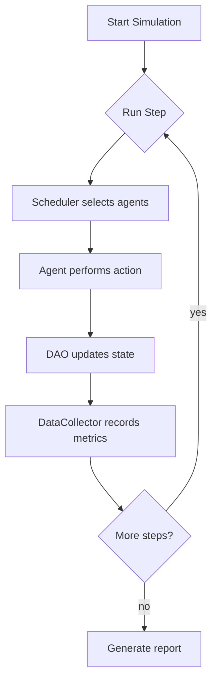
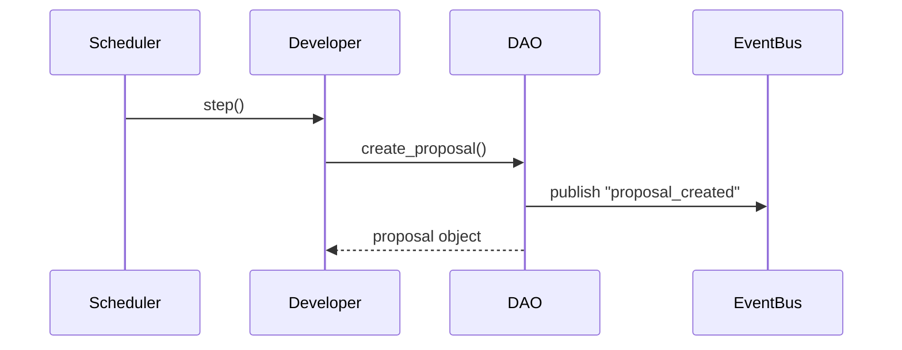
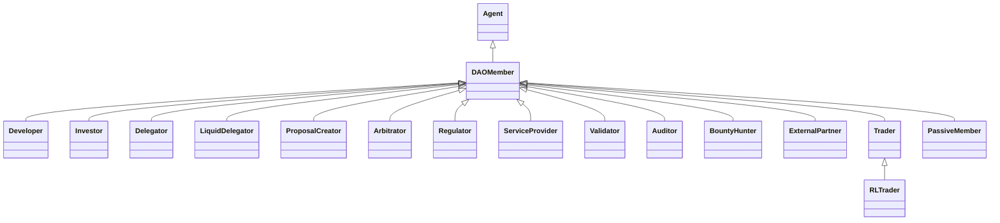
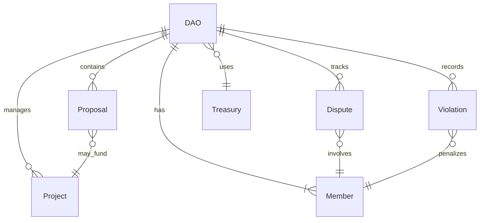
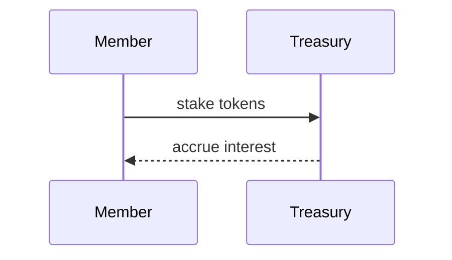
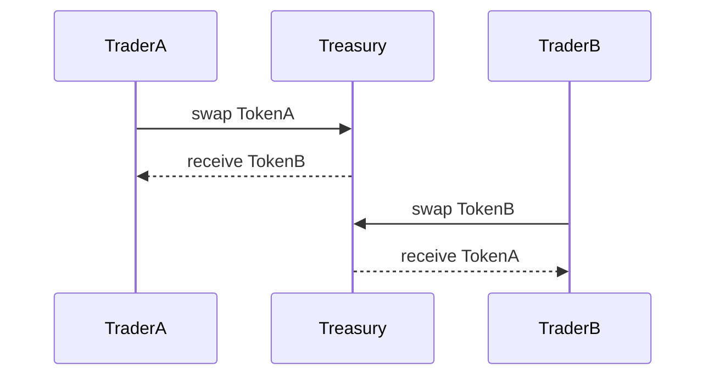
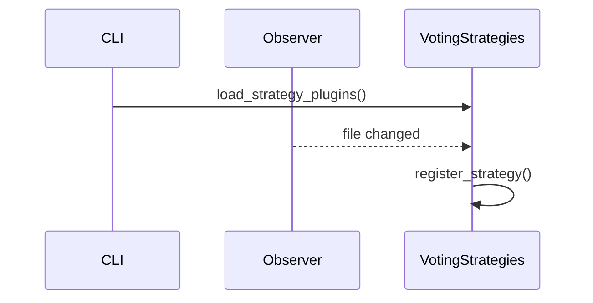

# DAO Simulator Diagrams

This page collects several Mermaid diagrams that illustrate how the main parts of the repository fit together.

## Architecture Flowchart

The flowchart shows the high level loop executed by `DAOSimulation.run()`.

## Sequence of an Agent Action

This sequence diagram highlights how a developer creates a proposal which is then announced through the event bus.

## Agent Class Hierarchy

The diagram reflects the structure defined in the `agents` package.

## Data Structure Relationships

This entity relationship diagram outlines how the core data structures interact.

## Staking Flow

## Liquidity Pool

## Strategy Plugin Reloading

The diagram shows how the `watch_strategy_plugins` helper automatically reloads
voting strategies when source files change.
